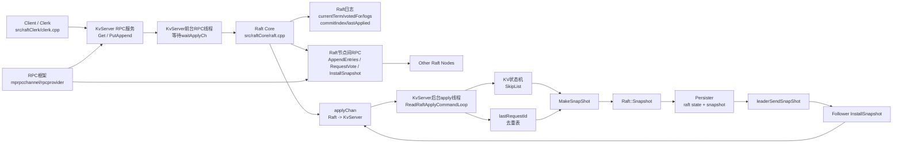
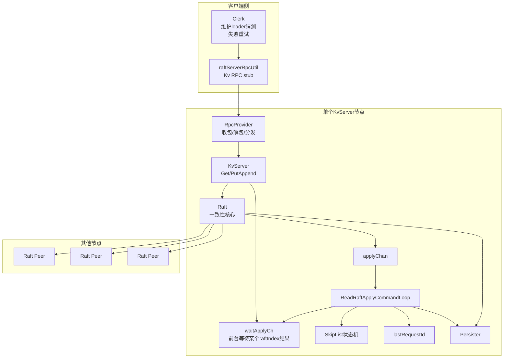
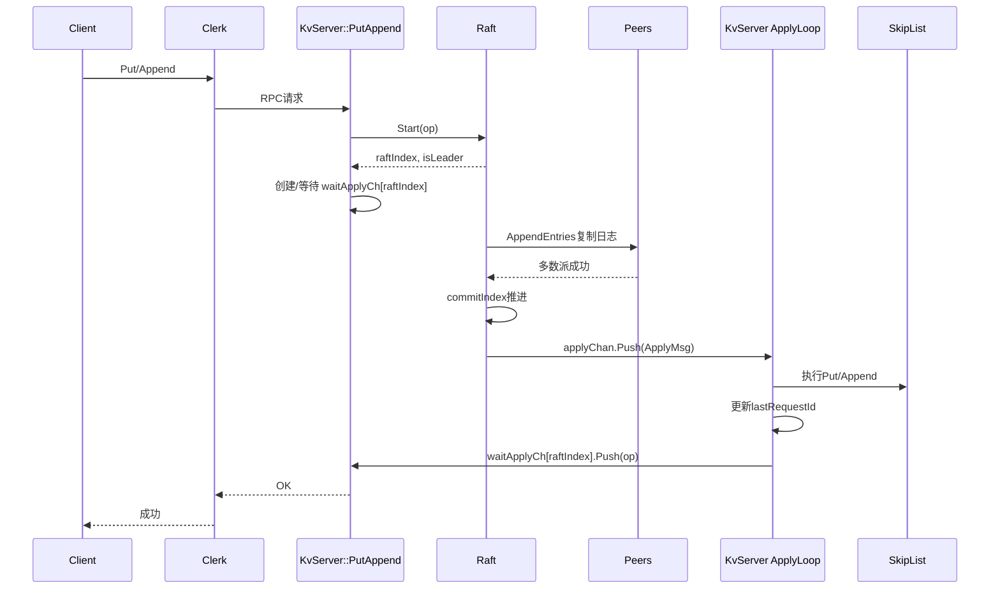
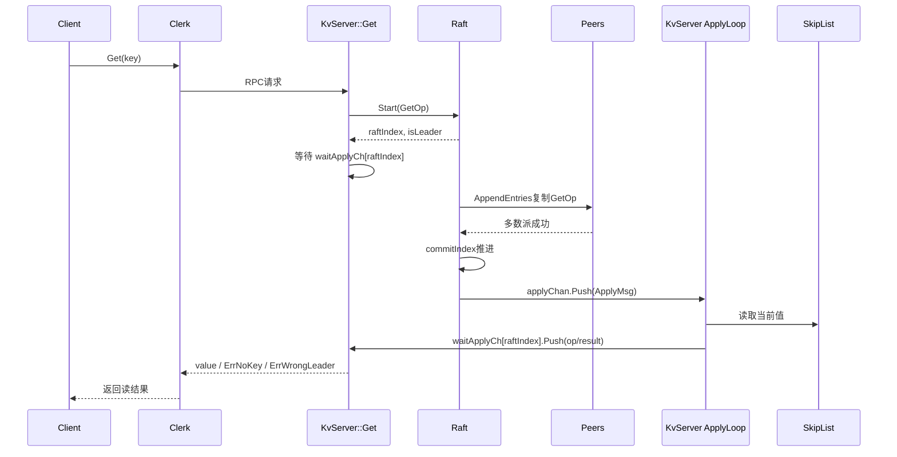
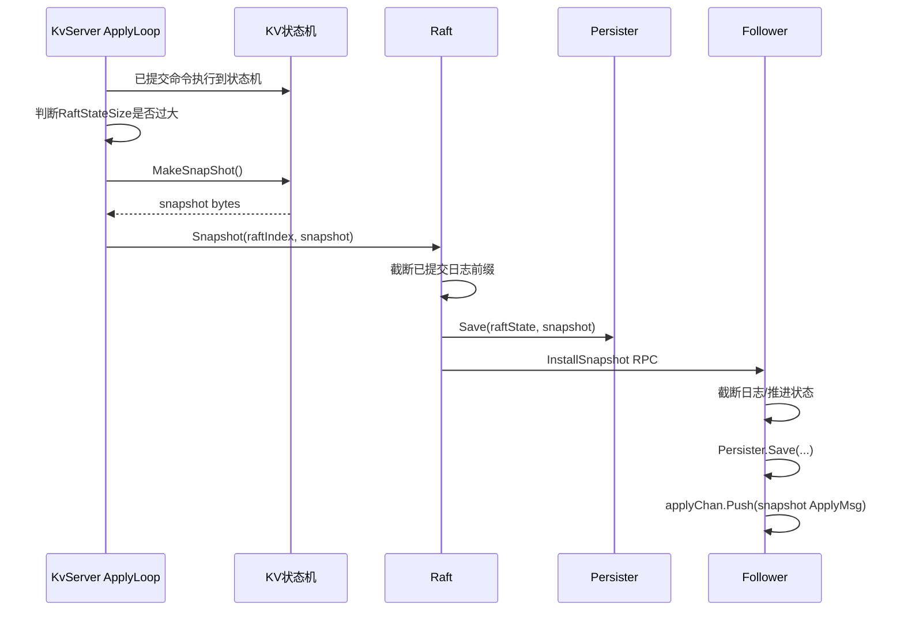
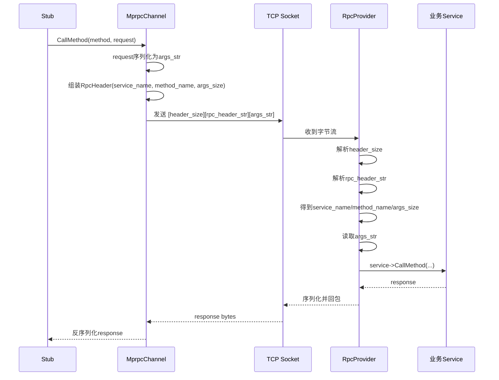

# Raft KV 项目系统组织架构与数据流图

这份文档适合用支持 Mermaid 的 Markdown 查看器打开。

## 1. 系统总图

## 2. 模块职责图

## 3. 写请求主链路

## 4. 读请求链路

## 5. Snapshot 链路

## 6. RPC 框架链路

## 7. 最短总纲

项目可以压缩成 6 层：

1. `raftClerk`
   作用：客户端重试、记 leader、发 RPC
2. `rpc`
   作用：底层 RPC 打包、收包、分发，不关心 Raft 语义
3. `KvServer`
   作用：对外提供 KV 服务；把请求送入 Raft；接收 apply 后真正操作状态机；维护幂等
4. `Raft`
   作用：选举、日志复制、提交、apply、snapshot 元信息管理
5. `Persister`
   作用：保存 `raft state + snapshot`
6. `skipList`
   作用：KV 状态机容器，本身不是一致性逻辑重点

## 8. 四条必须背下来的数据流

1. 写请求：`Clerk -> KvServer::PutAppend -> Raft::Start -> AppendEntries -> commit -> applyChan -> KV -> waitApplyCh -> reply`
2. 读请求：`Clerk -> KvServer::Get -> Raft::Start(GetOp) -> commit -> applyChan -> KV读 -> reply`
3. 快照：`KV状态机 -> MakeSnapShot -> Raft::Snapshot -> Persister -> InstallSnapshot -> follower恢复`
4. RPC：`stub -> CallMethod -> RpcHeader封包 -> socket -> RpcProvider解包 -> CallMethod分发 -> 回包`
